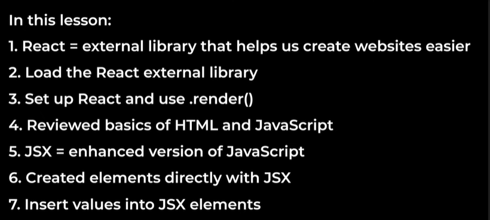

-11 Hour Video supersimpledev

dom combines html and java

Lesson 1: 

setup react via CDN (Content Delivery Network).
setup react and babel, what is babel? java compiler.
when using react we dont use javascript we use jsx,
babel translates jsx to js.

what does the render function do? 
multiple elements in a single div.

Lesson 2:
Chatbot that gets todays date,
flips a coin,
roll a dice
 -> whats a component?
- its a piece of a website
<></> fragments can group elements together
